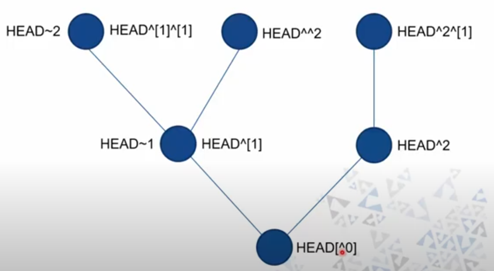
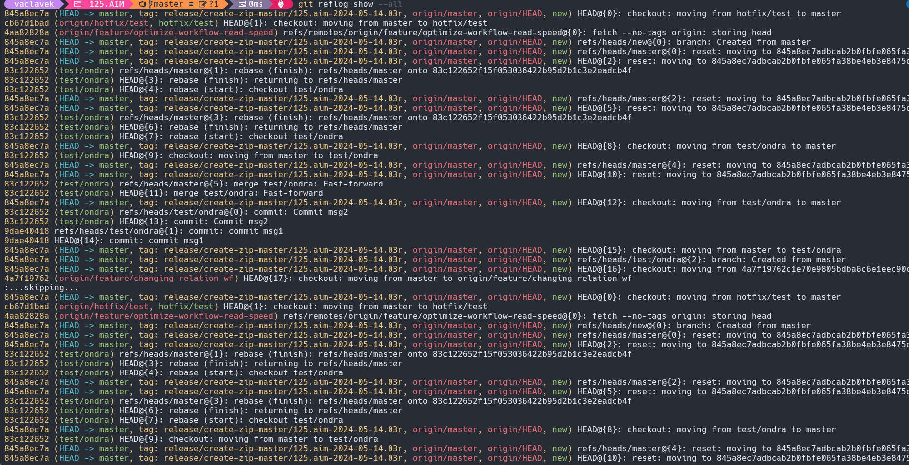

# GIT - Ondřej Václavek
HAVIT s.r.o., software architect

vaclavek@havit.cz

- Založil 2005 Linus Torvalds pro vývoj linuxového jádra	
- [Open-source](https://github.com/git/git)
- Cloud-based [Gitlab](https://about.gitlab.com), [Github](https://github.com), [Bitbucket](https://bitbucket.org), [Azure DevOps](https://azure.microsoft.com/cs-cz/products/devops), 
- On-premise [Gitlab](https://about.gitlab.com/install/), [Gerrit](https://azure.microsoft.com/cs-cz/products/devops), [Gitea](https://about.gitea.com)

## Principy fungování
- Distribuovaný (GIT, Mercurial, Bazaar) vs centralizovaný (CVS, SVN)
- Každý soubor uložen jen jednou ve formě snapshotu
- Soubory jsou uložené binárně, což redukuje velikost repositáře a přenos dat
- Změny se ukládají jako snapshoty
    - Komprimované pomocí zlib
- Všechny změny se provádí nejdřív lokálně "offline"
- Pro každou změnu se spočítá hash, změny jsou uložené ve stromové struktuře přes reference na hashe
- 4 "pracovní prostory:
    - working directory - pracovní (git add)
    - staging - připravené změny (git commit)
    - lokální repository (git push)
    - remote repository (git fetch)
- Větve se obnovují do stejného adresáře

## Proč používat GIT?
- Sledování změn
- Spolupráce 
- Větvení a jednoduché slučování
- Zpětné vrácení změn
- Ochrana dat
- Podpora pro týmy
- Open Source a Popularita
- Flexibilita
- Rychlost
- Offline práce
- Stále živý
- Rychlý

## Pojmy
- Repozitář (repository / repo)
- Commit
    - Zpráva
	- Informace o autorovi
	- Unikátní reference (SHA-1 hash, 160 bitů)

            echo "a" | git hash-object --stdin
            echo "b" | git hash-object --stdin
	- Parent commit (SHA-1 hash)
    - Čas commitu, změněné obsahy souborů
    - Identifikace - hash, branch, tag
- Push, pull, fetch
- Branch (větev)
- Tag (label)
- Reference
    - SHA hash
    - branch name
    - tag name
    - Vlnovka = úroveň
    - Stříška = pořadí rodiče

## UI nástroje
- IDE
- [Sourcetree](https://www.sourcetreeapp.com/)
- [GitHub Desktop](https://desktop.github.com/)
- [Visual Studio Code](https://code.visualstudio.com/)
- [GitKraken](https://www.gitkraken.com/)
- [Visual Studio](https://visualstudio.microsoft.com/)
- Tortoise GIT
- Git BASH - napovídá příkazy

## inicializace
Inicializace nového repozitáře

      git init # založí nový lokální repozitář
      git clone <URL> # naklonuje vzdálený repozitář
      git remote add <shortcut> <URL> # přidá k aktuálnímu repozitáři vzdálený  obraz

## status
- nezměněné soubory = working tree clean
- změněné soubory = Changes not staged for commit
- soubory ve staging = Changes to be committed
- nové soubory = Untracked files

## commit
- jedna změna -> rozdělit na logické části
- stručný a výstižný název (přítomnný čas)
- podrobný popis
- odkaz na úkol
- ammend vytváří nový commit

      git commit # commit, kde zpráva se zadává interaktivně
      git commit -m "Zpráva" # commit se zprávou
      git commit --amend -m "Přidání změn" # neměňte veřejné commity

## Interaktivní materiály
- [Learn branching](https://learngitbranching.js.org/?NODEMO)
- [Procvičování GITu s online tutoriálem](https://profy.dev/project/github-minesweeper)
- [Vizuální vysvětlení](https://marklodato.github.io/visual-git-guide/index-en.html)
- [Tutoriál](https://www.atlassian.com/git/glossary#commands)

## .gitignore
- [šablona pro různé jazyky](https://github.com/github/gitignore/tree/main)
- ignorování commitu adresářů nebo souborů

## log
Pro výpis všech commitů, zobrazení změn v souborech, filtrování historie a zobrazení historie větví

    git log --oneline # výpis na jeden řádek
    git log -3 # jen 3 poslední commity
    git log --oneline --after="2024-05-01" --before="2024-05-08" --author="Pepa" # filtrování
    git log --all # všechny větve
    git log --oneline --all --decorate --graph # zobrazení grafu branchí a commitů
    git log --pretty=format:'%h %ad | %s%d [%an]' --graph --date=short --since='7 days ago' # custom formátování

[Dokumentace](https://git-scm.com/docs/git-log)

## reset
Umožňuje vrátit obsah repositáře k určitému commitu. Změny __po daném commitu__ budou odstraněny.

    git reset --soft commitid # pouze změní HEAD
    git reset --mixed # zachová změněné soubory, odstraní commity
    git reset --hard # odstraní změny

    git revert HEAD --no-edit

## branch
Větve jsou pouze ukazatele na commit. Když vytvoříme větev, git vytvoří nový ukazatel, nemění historii.

Typické uspořádání:
- Hlavní větev - main (master)
- Feature větve - vývoj nových funkcí
- Hotfix větve - opravy chyb

Výhody:
- Paralelní vývoj
- Izolace změn
- Experimenty bez vlivu na zbytek codebase
- Správa verzí

Práce s branchemi:

    git branch --all # seznam všech větví
    git branch newbranch # vytvoření nové větve
    git checkout newbranch # přepnutí na branch
    git checkout master # přepnutí na brach master
    git branch -m newbranch newbranch2 # přejmenování
    git branch -d newbranch2 # smazání
    git checkout -b newbranch # založení nové větve a rovnou se do ní přepneme

## tag
Označení commitu libovolným tagem

    git tag V2022 # přidání jednoduchého tagu
    git tag -a v1.4 -m "my version 1.4" # přidání tagu se všemi informacemi (jako commit)
    git tag -d v1.4 # smazání tagu

## merge
Slouží k integraci změn z jedné větve do druhé, čímž se spojí historie obou větví.
Provede nový "merge" commit (kromě fast-forward varianty).
Merguje se z cizí branche do mé (tzn. při použití jsme v master branchi a mergujeme "k sobě" feature branch).

    git merge newbranch
    git merge --squash newbranch # merge se sloučením do jednoho commitu

V případě konfliktu je merge přerušen, pokračování je možné

    git merge --continue # pokračování v commitu
    git merge --abort # zrušení commitu

Typy sloučení:
- fast-forward merge - novější commity se "napojí" na poslední commit. Nevyžaduje lidský zásah, nevzniknou konflikty. Nelze použít u větví, kde probíhaly změny
- 3-way merge - sloučení změn z větví, kde v obou probíhaly změny

      git mergetool --tool-help

Při sloučení mohly vzniknout konflikty, pokud došlo k:
- úpravě stejného řádku souboru
- mazání nebo přejmenování změněných souborů
- změny v různých částech stejného souboru

Řešení konfliktů je běžnou součástí práce, pokud probíhá paralelní vývoj nad stejnou codebase.
- Pokud GIT nedokáže sám vyřešit kolizi, označí konflikt a nechá na uživateli, aby jej vyřešil. 
- Merge probíhá, dokud nejsou všechny konflikty vyřešené.
- Pokud uživatel neví, jak konflikty dokončit, může merge zrušit
- GUI významně pomáhá k řešení konfliktů - umožňuje vizuálně porovnat konfliktní změny

## rebase
Rebase přenáší commit do jiné branche (tzn. při použití jsme ve feature branchi a provádíme rebase do master)
Rebase vs. merge
- Rebase nesmíme použít, pokud commit jsou již veřejné.
- Rebase nepoužijeme, pokud nám jde o přesnou historii commitů.
- Interaktivní rebase "úpravy aktuálního indexu"
    - Slučování commitů
    - Rozdělování commitů
    - Přejmenování commitů
    - Úprava pořadí
    - Úprava commitu

      git rebase --interactive HEAD~3

Advanced řešení: 
- featureB je založena na featureA
- později jsme zjistili, že featureB na změnách ve featureA nijak nezávisí
- přesuneme featureB z featureA na master

        git rebase --onto <newbase> <oldbase> <branch>
        git rebase --onto main featureA featureB

       o---o---o---o---o  main
        \
         o---o---o---o---o  featureA
              \
               o---o---o  featureB

### Řešení konfliktu

Příklad (včetně vytvoření konfliktu)

    git branch new # založení nové branche
    echo "New" >> new.txt # zapsání textu do souboru
    git add new.txt # přidání souboru do gitu
    git commit -m "Added in new branch" # commit
    git checkout master # přepnutí do master branche
    echo "Master" >> new.txt # zapsání textu do souboru (obsah je konfliktní)
    git commit -m "Added in master" # commit
    git merge new # pokus o merge branche new do branche master
    git status # stav gitu
    cat new.txt # podíváme se do souboru
    notepad new.txt # opravíme konflikt
    git add new.txt # přidáme změněný soubor do gitu
    git commit -m "Merged" # commit

## reflog
Log změna všech referencí - záchranná síť, pokud ztratíme commit.

    git reflog # základní příkaz pro zobrazení
    git reflog show --all
    git reflog stash # reflog pro stash

## diff

Zobrazí změny mezi commity / branchemi 

    git diff newbranch master

Vytvoří patch soubor z aktuální větve proti fixbranch a uloží jej do souboru

    git format-patch fixbranch --stdout > bugfix.patch
    git apply --stat a_file.patch # přehled změněných souborů
    git apply --check a_file.patch # kontrola chyb
    git am bugfix.patch # použije patch jako commit
    git am --keep-cr --signoff < a_file.patch # s autorstvím a řešenými konci řádku různých systémů

## cherry-pick
Umožňuje použít jinou změnu v mé branchi. Vytváří nový commit = kopii se jménem aktuálního uživatele

    git cherry-pick <commit-sha>

## stash
Lokální uložení změn

    git stash # uložení
    git stash save "Message" # uložení se zprávou
    git stash --include-untracked # uložení včetně netrackovaných souborů
    git stash list # seznam
    git stash pop # načtení    
    git stash pop stash@{2} # použití stashe, zero-based 
    git stash drop stash@{1} # smazání předposledního
    git stash clear # smazání všech

## blame
Kontrola posledních změn v souboru

    git blame file.txt

## Připojení k serveru

      git remote add origin https://gitlab.com/skolenigitk2/SkoleniGit.git

Vygenerování SSH klíčů

      ssh-keygen -t ed25519 -C "<comment>"

## Konfigurace
    git config --list
    git config --global user.name "Ondřej Václavek"
    git config --global user.email vaclavek@havit.cz
    git config --global core.editor "code --wait"
    git config --global core.editor "notepad"
    git config --global merge.autoStash true
    git config --global init.defaultBranch main
    git config --global alias.co checkout

Aliasy

    [alias]
      co = checkout
      ci = commit
      st = status
      br = branch
      hist = log --pretty=format:'%h %ad | %s%d [%an]' --graph --date=short
      type = cat-file -t
      dump = cat-file -p

## fetch
Stáhne změny ze vzdáleného repositáře bez toho, aby se změny aplikovaly do indexu

    git fetch

## pull
Stáhne fetch ze vždáleného repositáře a aplikuje je do indexu.
Je ekvivalentní jako git fetch && git merge

    git pull 

## push
Odešle připravené změny na server.
    
    git push --set-upstream <remote name> <branch>
    git push --set-upstream origin main

## prune
Promaže staré nedosažitelné commity v repozitáři.

    git remote --prune # udělá fetch a odstraní snazané branche
    git prune --dry-run --verbose # odstraní lokální nedosažitelné commity

## hooks
Skripty, které lze spouštět na základě GIT událostí.

## .gitattributes
Nastavuje pro jednotlivé cesty
[Vzor](https://github.com/gitattributes/gitattributes)

    text=auto
    *.cs text diff=csharp
    *.bmp binary
    *.proj text eol=crlf merge=union

## interní struktura 
- Blob
- Tree
- Commit
- Tag

    git cat-file commit <comitid>
    git cat-file -p <treeid>

## cheatsheat
[PDF cheatsheet](cheatsheet.pdf)

